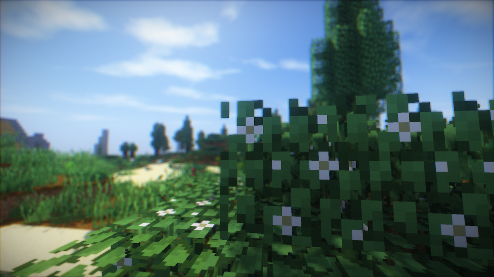
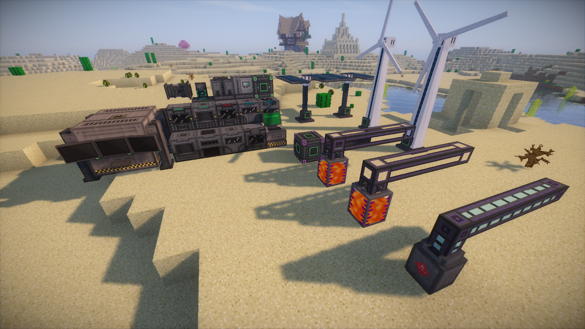
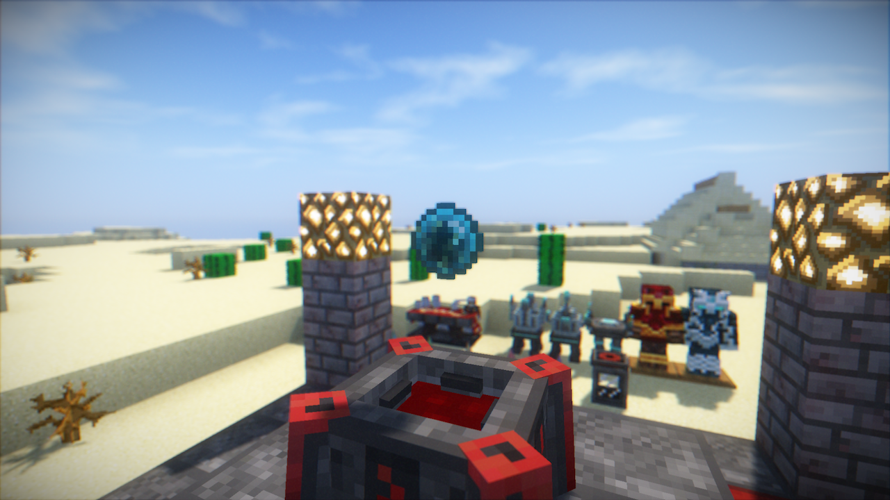
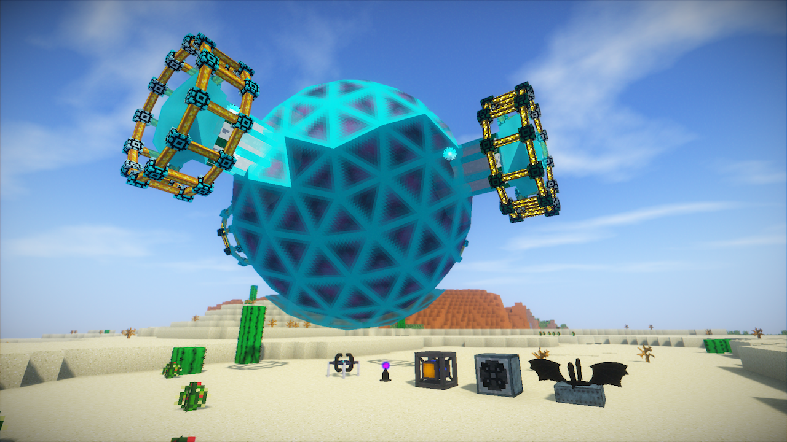
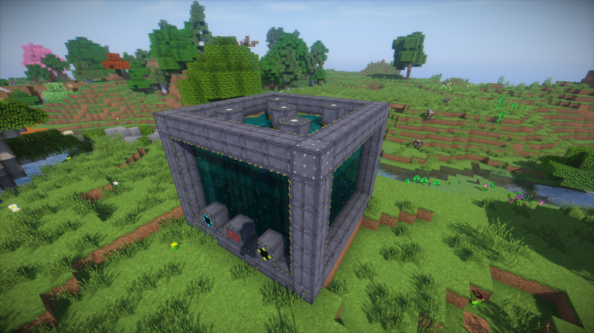
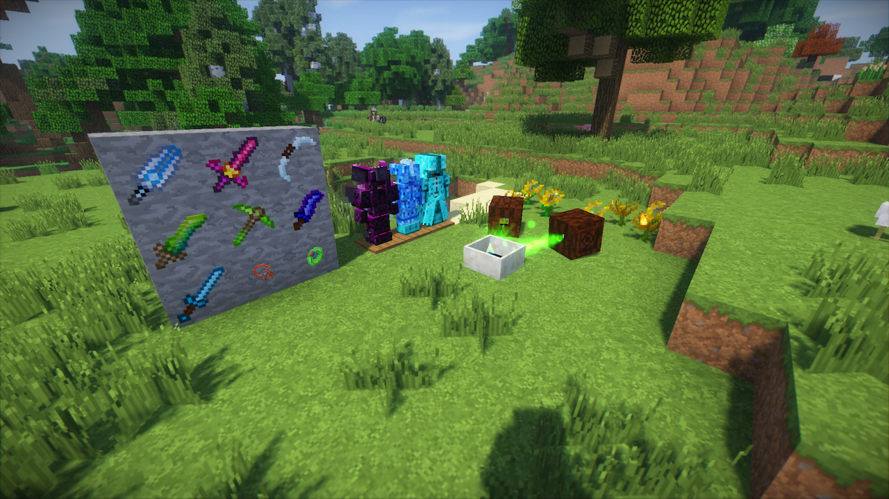
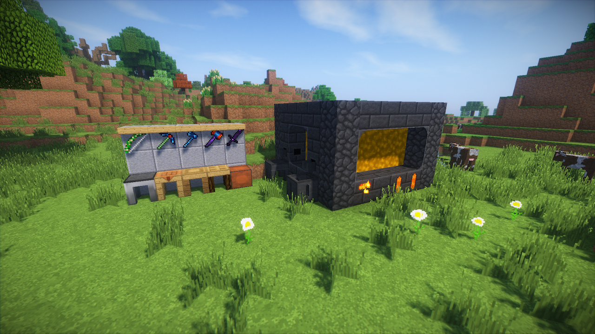

# Equilibria
***Equilibria*** is a modern and balance modpack for Minecraft 1.10.2. It isn't a "kitchen sink" modpack, but it has plenty of content to keep the game interesting for quite a while.

For a mod list, please go to the [mod list page](MOD_LIST.md). All mod authors are properly credited.

## Join & Play
For the download link and server IP, [join my Discord server](https://discord.io/rayzrdevofficial) and ask me about it.

## Screenshots

