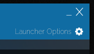
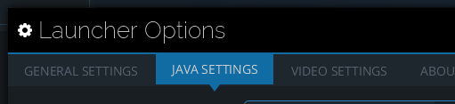
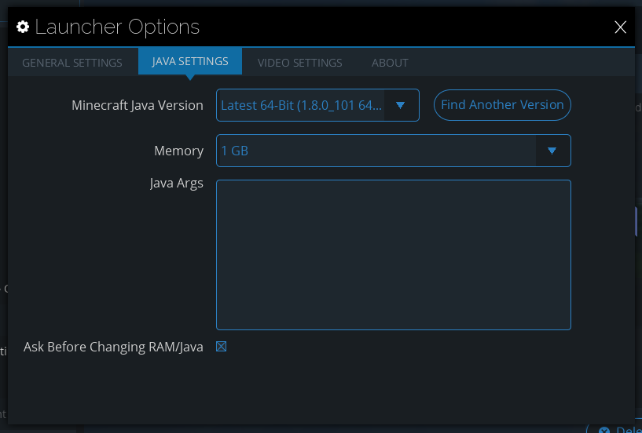
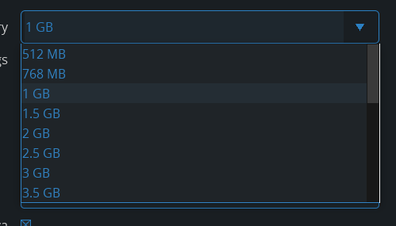
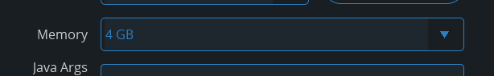

# Technic RAM Fix
By default when you [install the Technic Launcher](https://www.technicpack.net/download) it is set to only use 1 gigabyte of RAM. Most modpacks require more than this, so the packs crash when they launch (or launch/run slowly). It's very simple to fix this.

### Step 1

Click on the *Launcher Options* button in the Technic Launcher.

### Step 2

Select the *Java Settings* tab.

### Step 3

You should have a window open that looks like this. First, check that the *Minecraft Java Verison* is 64-bit. If it isn't, select a 64-bit version. If there are no 64-bit versions available, please download the latest 64-bit version [from Java's website](http://java.com/en/download/). Once that has installed, restart the Technic Launcher and repeat steps 1-3.

### Step 4

Edit your *Memory* setting to something preferably higher than 2 gigabytes. I run mine at 8 gigabytes, but my computer has a lot of RAM. You can always try setting the *Memory* setting to the max available value.

### Step 5

Your memory should now look something like this.

***Congratulations!*** That's it.